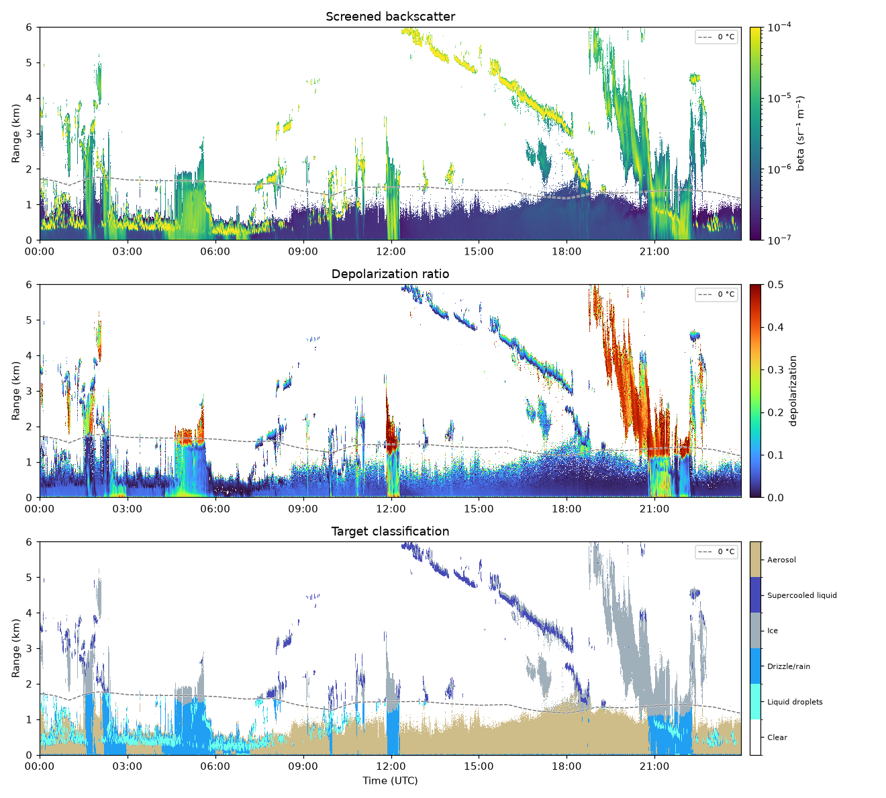

# ceiloclass

[](https://github.com/actris-cloudnet/ceiloclass/actions/workflows/ci.yml)

Cloud, aerosol and precipitation classification from ceilometer and lidar
backscatter and model temperature. Built on
[ceilopyter](https://github.com/actris-cloudnet/ceilopyter) for reading and
harmonizing the instrument data.

## Installation

Not yet on PyPI, so install from source:

```sh
git clone https://github.com/actris-cloudnet/ceiloclass.git
cd ceiloclass
python3 -m venv venv
source venv/bin/activate
pip install .
```

## Usage

Fetch and classify a day of raw ceilometer data for a site (the instrument is
discovered automatically; if a site has several, you are prompted to pick one):

```sh
ceiloclass -s munich -d 2025-05-25 --show
```

Add `--harmonized` to use the Cloudnet harmonized lidar product instead of raw
data, `-i` to narrow to a particular instrument, or pass local files directly:

```sh
ceiloclass --harmonized -s munich -d 2025-05-25 --show
ceiloclass -i cl61 ceilo.nc -m model.nc --plot out.png
```

`--harmonized` covers every harmonized backscatter instrument at the site —
ceilometers, PollyXT, DIAL (e.g. the Vaisala DA10), and the experimental
doppler-lidars — prompting when several are available. Use `-i` to pick one
directly, e.g. a HALO doppler lidar:

```sh
ceiloclass --harmonized -i halo -s bucharest -d 2026-05-19 --show
```

Classify the CL61 lidar product at Kenttärova, averaging into
30 s bins, using the HARMONIE model and showing the plot up to 6 km:

```sh
ceiloclass -s kenttarova -d 2023-09-04 -a 30 --harmonized -i cl61 -m harmonie-fmi-6-11 --max-y 6 --show --no-histogram
```



## Arguments

| Argument               | Description                                                                                                                                                                                                                                                             |
| ---------------------- | ----------------------------------------------------------------------------------------------------------------------------------------------------------------------------------------------------------------------------------------------------------------------- |
| `files`                | Ceilometer data file(s). If omitted, files are fetched using `--site`/`--date`.                                                                                                                                                                                         |
| `-i`, `--instrument`   | Instrument. For local raw files, the reader: `cl31`, `cl51`, `cl61`, `chm15k`, `cs135`, `ct25k`, `ld40`. When fetching a harmonized product it is optional and filters by instrument-id substring (e.g. `halo`, `pollyxt`, `cl61`); you are prompted if several remain. |
| `--harmonized`         | Use a Cloudnet harmonized backscatter product (ceilometers, PollyXT, DIAL, doppler-lidars) instead of raw data.                                                                                                                                                         |
| `--no-rescreen`        | With `--harmonized`, classify the product's own screened beta instead of re-screening `beta_raw` (the default). Cloudnet's screening is less aggressive, so it keeps more weak/edge signal.                                                                             |
| `--no-surface-liquid`  | Do not detect fog / low stratus from the lowest range gates. Use when the instrument's near-surface overlap correction is unreliable and produces spurious surface liquid layers.                                                                                       |
| `-m`, `--model`        | Cloudnet model netCDF file, or a model id to fetch (e.g. `ecmwf`, `harmonie-fmi-6-11`) when using `--site`/`--date`.                                                                                                                                                    |
| `-s`, `--site`         | Cloudnet site id (to fetch raw files and/or model), e.g. `munich`.                                                                                                                                                                                                      |
| `-d`, `--date`         | Date `YYYY-MM-DD` (to fetch raw files and/or model).                                                                                                                                                                                                                    |
| `--download-dir`       | Directory for fetched files (default: the package `data/` directory).                                                                                                                                                                                                   |
| `--calibration-factor` | Override the backscatter calibration factor.                                                                                                                                                                                                                            |
| `-a`, `--average`      | Average into time bins of this width (seconds) before classifying (faster).                                                                                                                                                                                             |
| `--plot`               | Write a classification plot to this PNG file.                                                                                                                                                                                                                           |
| `--show`               | Show the plot in a window.                                                                                                                                                                                                                                              |
| `--max-y`              | Upper limit of the range axis in plots (km).                                                                                                                                                                                                                            |
| `--no-histogram`       | Omit the diagnostic backscatter histogram panel from plots.                                                                                                                                                                                                             |

## How it works

Each time–range pixel is classified from attenuated backscatter and model
temperature alone. The method follows CloudnetPy's target
classification, restricted to the parts that work without radar:

- **Liquid layers** are detected as sharp backscatter peaks. A layer is
  **supercooled liquid** where the model wet-bulb temperature is below 0 °C, and
  a warm **liquid droplet** layer otherwise.
- **Strong, non-liquid signal** is cloud or precipitation: **ice** in the
  sub-freezing air above the 0 °C level, **drizzle/rain** in the warm air below
  it. The backscatter threshold separating this from weaker signal is picked per
  file from the backscatter histogram, so it adapts to each site/day's aerosol
  load.
- Remaining signal is **aerosol**; gates with no signal are **clear**.
- With a CL61, the depolarization ratio splits ice from liquid (non-spherical ice
  depolarizes strongly) and anchors the freezing level to the observed ice.

## License

MIT
